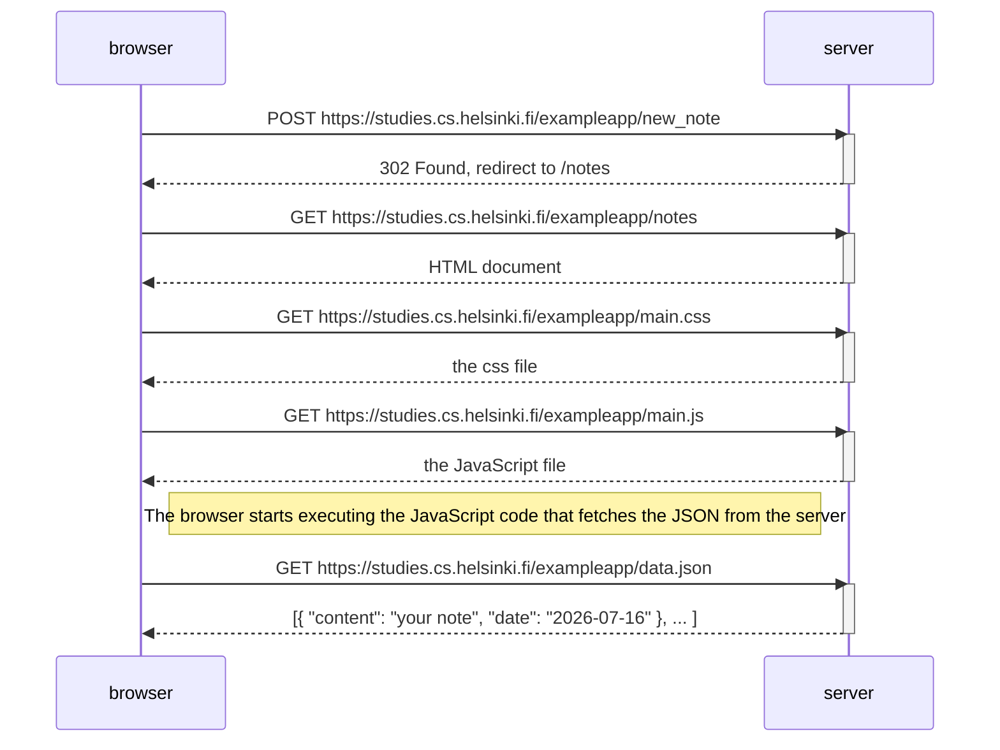
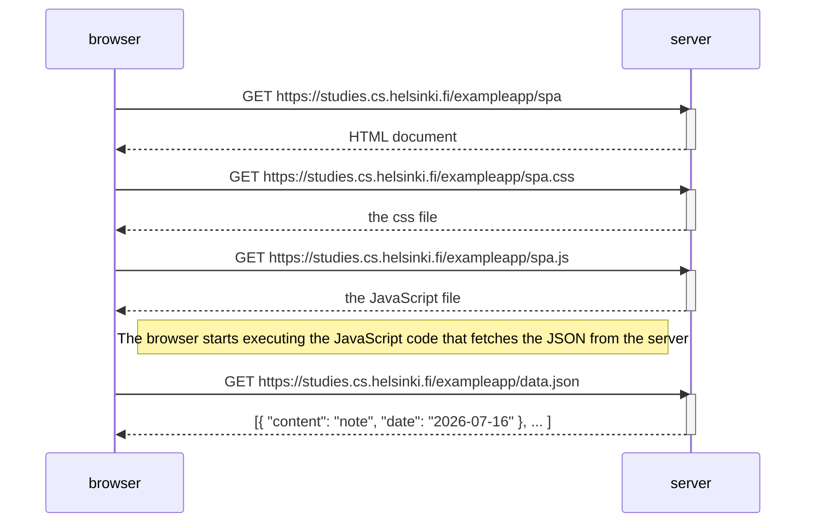
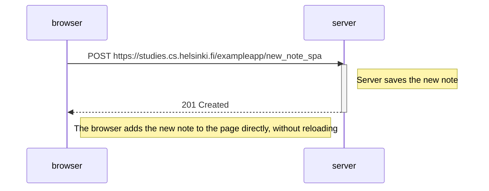

# Part 0 Diagrams

## 0.4 New note diagram

When the Save button is clicked, the browser sends a POST request with the note data. The server saves it and redirects the browser back to the notes page. Because it's a full page reload, the browser has to request the HTML, CSS, and JS files all over again, and finally the JSON data containing the notes.

## 0.5 Single page app diagram

Loading the SPA version triggers four separate GET requests — the HTML, the CSS, the JS, and finally the notes data as JSON. Everything needed for the page comes in through these requests before anything is displayed.

## 0.6 New note in single page app diagram

Unlike the regular app, creating a note in the SPA doesn't reload the page. The browser just sends one POST request, and the server responds with 201 Created. JavaScript then adds the new note directly onto the page without asking for anything else — the page just stays put.
